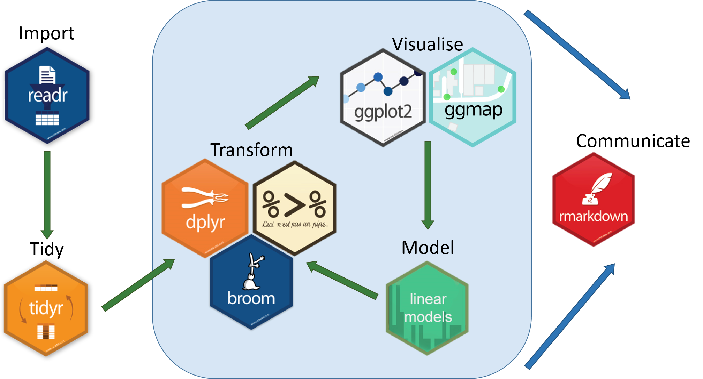

```{r setup, include=FALSE}
knitr::opts_chunk$set(echo = TRUE,message=FALSE, warning=FALSE)
options(scipen = 999)
library(knitr)
library(jpeg)
```

## Slide to Delete

```{r echo=FALSE, message=FALSE, warning=FALSE,out.width=100, fig.cap="Follow Along!"}

```

## Who am I?

Army 

- Combat Engineer
- Platoon Leader / XO / Company Commander
- Geospatial / Sapper / Route Clearance
- Hawaii / White Sands Missile Range / Iraq / Afghanistan

Education

- West Point '07
  - Operations Research, BS
- Missouri University of Science and Technology '12
  - Engineering Management, MS
- THE Ohio State '16
  - Integrated Systems Engineering, MS
  - Applied Statistics, Graduate Minor

Data Science

- R User Since '14
- Catch me on Twitter [`@dtdusty`](www.twitter.com/dtdusty)
- <http://dusty-turner.netlify.com/>


## What am I assuming about you?

:::::::::::::: {.columns}
::: {.column}

- Data Science Background

- Moderate R Background

- Pretty much a 'super nerd'

:::
::: {.column}

```{r echo=FALSE, message=FALSE, warning=FALSE, fig.cap="www.tenor.com"}

```

:::
::::::::::::::

## What are we going to talk about?

:::::::::::::: {.columns}
::: {.column}
Lets talk about

- Modeling in R the old way (`caret`)

- Modeling in R the (very) new way (`tidymodels`)

Lets also weave in an example (Flying Hour Challlenge)

:::
::: {.column}

```{r echo=FALSE, message=FALSE, warning=FALSE}

```

:::
::::::::::::::

## Background: Out with "The Old"

The `Caret` Package

- Classification And REgression Training

Functionality

- Inpute Missing Data
- Split Test/Train/Validate Set
- Supports a Multitude of Modeling Techniques
- Supports Cross Validation

Drawbacks

- Requires unique syntax to support each package / imputation technique
- Not 'tidy' compatible

## Background: In with "The New"

The `tidymodels` package

- Released in October 2019

Functionality

- Inpute Missing Data 
- Split Test/Train/Validate Set
- Supports a Multitude of Modeling Techniques
- Supports Cross Validation
- Supports model performance measurements

Advantages

- Streamlines syntax for all model types / packages
- 'tidy' compatible
- Easy to compare model performance

## More details of `tidymodels`

:::::::::::::: {.columns}
::: {.column}

From the documentation:

- "`tidymodels` is a ''meta-package" for modeling and statistical analysis that share the underlying design philosophy, grammar, and data structures of the `tidyverse`."

<https://github.com/tidymodels/tidymodels>

`install.packages("tidymodels")`

Author is Max Kuhn of RStudio [`@topepo`](www.twitter.com/topepo)

:::
::: {.column}

```{r echo=FALSE, message=FALSE, warning=FALSE,out.width=100, fig.cap="Max Kuhn at West Point Fall 2018"}

# include_graphics("MaxTemp.JPG")
```

:::
::::::::::::::

# The Modeling Process

## Tidyverse Schema

```{r echo=FALSE, message=FALSE, warning=FALSE, fig.cap="https://www.tidyverse.org/"}

```

## Tidymodels Schema

```{r echo=FALSE, message=FALSE, warning=FALSE, fig.cap="https://www.tidyverse.org/"}
include_graphics("03_presentation_files/tidymodels.png")
```

## What We're Going to Do:

- Introduce a Data Problem

  - Flying Hour Challenge

- Show the 'old techniques'

  - imputation
  - modeling
  - prediction
  - model comparison

- Show the new technique

  - `tidymodels`

- Discuss Challenges


## Libraries

```{r}
library(tidyverse)
library(janitor)
library(tidymodels)
library(flextable)
library(lubridate)
```

## Flying Hour Challenge

```{r include=FALSE}
rawdata = read_csv("01_data/mors_cleaned_ID.csv") %>%
  janitor::clean_names() 
```


```{r, fig.align='left', fig.width=8}
read_csv("01_data/mors_cleaned_ID.csv") %>%
  janitor::clean_names() %>%
  mutate(as_of_date = mdy(as_of_date)) %>%
  select(hours_flown, as_of_date,id,id2,id3,mc_percent) %>%
  head(10) %>%  
  flextable() %>% 
  autofit()
```

## `Skimr` Numeric Variables

```{r echo=FALSE}
helper =
skimr::skim(rawdata) %>%
  filter(type=="numeric") %>%
  select(-type)  %>%
  filter(stat == "hist") %>%
  select(variable, formatted)

skimr::skim(rawdata)  %>%
  filter(type=="numeric") %>%
  select(-type)  %>%
  pivot_wider(id_cols = variable, names_from = stat) %>%
  select(-hist) %>%
  left_join(helper, by = "variable") %>%
  rename(hist = formatted) %>%
  select(-c(complete,p25,p75)) %>%
  mutate_if(is.numeric, round, 2) %>%
  slice(1:15) %>%
  flextable() %>% autofit()
```

## `Skimr` Character Variables

```{r echo=FALSE}
skimr::skim(rawdata)  %>%
  filter(type=="character") %>%
  select(-type)  %>%
  pivot_wider(id_cols = variable, names_from = stat) %>%
  flextable() %>% autofit()
```

## Data Issues

```{r echo=FALSE}
rawdata %>%
  mutate(row_id = row_number()) %>%
  mutate_all(as.character) %>%
  pivot_longer(cols = -row_id) %>%
  mutate(isna = is.na(value)) %>%
  count(name,isna) %>%
  mutate(isna = if_else(isna,"Missing","NotMissing")) %>%
  pivot_wider(names_from = isna, values_from = n) %>%
  arrange(-Missing) %>% 
  head(22) %>% flextable() %>% autofit()
```

## Plot View

```{r echo=FALSE, cache=TRUE, dpi=500}
rawdata %>%
  mutate(row_id = row_number()) %>%
  # select(fy:cab,row_id) %>%
  mutate_all(as.character) %>%
  pivot_longer(cols = -row_id) %>%
  mutate(isna = is.na(value)) %>%
  count(name,isna) %>%
  mutate(isna = if_else(isna,"Missing","NotMissing")) %>%
  pivot_wider(names_from = isna, values_from = n) %>%
  filter(!is.na(Missing)) -> helper

library(wesanderson)
pal = wes_palette(name = "BottleRocket1", n = 2)

rawdata %>%
  select(helper$name) %>%
  mutate(row_id = row_number()) %>%
  # select(fy:cab,row_id) %>%
  mutate_all(as.character) %>%
  pivot_longer(cols = -row_id) %>% slice(1:100000) %>%
  mutate(isna = is.na(value))  %>%
  mutate(row_id = as.numeric(row_id)) %>%
  mutate(name = str_sub(name,1,7)) %>%
  ggplot(aes(name, row_id, fill = isna)) +
    geom_raster(alpha=0.8) +
    scale_fill_manual(name = "",
        values = pal[2:1],
        # values = c('steelblue', 'tomato3'),
        labels = c("Present", "Missing")) +
    scale_y_continuous(breaks = seq(0,100000,1000)) +
    labs(x = "Variable",
           y = "Row Number", title = "Sample of Missing Values in Rows") +
    coord_flip() +
  theme(legend.position = "bottom")
```

## Caret Piece

```{r}

library(caret)

maybedata = read_csv("01_data/mors_cleaned_ID.csv") %>%
  janitor::clean_names() %>%
  # sample_n(1000) %>%
  select(-c(gain_loss,nmcs_org_percent, nmcs_spt_percent, nmcm_equip_percent, pmcs_org_percent, pmcs_spt_percent, pmcm_org_percent, pmcm_spt_percent,on_hand_inventory,nmcs_org_days_hrs, nmcs_org_percent, nmcs_spt_days_hrs, nmcm_equip_days_hrs, pmcs_org_days_hrs, pmcs_spt_days_hrs, pmcm_org_days_hrs, pmcm_spt_days_hrs, army_accept_date,id,id2,id3)) %>%
  mutate(as_of_date = mdy(as_of_date)) 


maybedata %>% Amelia::missmap()
ncol(maybedata)
# preprocessvalues = preProcess(caretraw[,-36], method = c("medianImpute","nzv"))
preprocessvalues = preProcess(maybedata[,-33], method = c("medianImpute","nzv"))
# caretimpute = predict(preprocessvalues, caretraw)
caretimpute = predict(preprocessvalues, maybedata)

Amelia::missmap(caretimpute)

trainIndex <- createDataPartition(caretimpute$hours_flown, p = .7) 

dataTrain <- caretimpute[trainIndex$Resample1,]
dataTest  <- caretimpute[-trainIndex$Resample1,]

fitControl <- trainControl(method = "none")
# str(dataTrain)
# summary(lm(hours_flown~.,data = dataTrain))

caretlm <- train(hours_flown ~ ., data = dataTrain, 
                 method = "lm", 
                 trControl = fitControl)

caretrf <- train(hours_flown ~ ., data = sample_n(dataTrain,5000), 
                 method = "rf", 
                 trControl = fitControl)

caretglm <- train(hours_flown ~ ., data = dataTrain, 
                 method = "glmnet", 
                 trControl = fitControl)

lm.pred = predict(caretlm, dataTest)
rf.pred = predict(caretrf, dataTest)
glm.pred = predict(caretglm, dataTest)

postResample(pred = lm.pred, dataTest$hours_flown)
postResample(pred = rf.pred, dataTest$hours_flown)
postResample(pred = glm.pred, dataTest$hours_flown)
caretlm

```


## Split, Prepare, and Inpute Data
```{r}

data = maybedata

data_split = data %>% initial_split(prop = .7)

# data_split %>%
#   training()
# data_split %>%
#   testing()

flight_recipe = 
data_split %>%
  training() %>%
  recipe(hours_flown ~ .) %>%
  recipes::step_meanimpute(
    age_years_by_accept_date, fmc_percent,nmcs_percent, mc_percent,nmcm_org_percent,
    nmcm_percent,nmcm_spt_percent, nmcm_depot_percent,pmcs_percent,pmc_percent,
    pmcm_percent
    ) %>%
  step_corr(
    age_years_by_accept_date, fmc_percent,nmcs_percent,mc_percent,nmcm_org_percent,
    nmcm_percent,nmcm_spt_percent, nmcm_depot_percent,pmcs_percent,pmc_percent,
    pmcm_percent
    ) %>%
  step_center(
    age_years_by_accept_date, fmc_percent,nmcs_percent,nmcm_org_percent,
    nmcm_percent,nmcm_spt_percent, nmcm_depot_percent,pmcs_percent,pmc_percent,
    pmcm_percent
    ) %>%
  step_scale(
    age_years_by_accept_date, fmc_percent,nmcs_percent,nmcm_org_percent,
    nmcm_percent,nmcm_spt_percent, nmcm_depot_percent,pmcs_percent,
    pmcm_percent
  ) %>%
  prep()
```

## Build Models
```{r}
flight_testing = flight_recipe %>%
  bake(training(data_split)) 

flight_training = juice(flight_recipe)

flight_ranger = 
  rand_forest(trees = 50, mode = "regression") %>%
  set_engine("ranger") %>%
  fit(hours_flown ~ ., data = flight_training)

flight_rf = 
  rand_forest(trees = 10, mode = "regression") %>%
  set_engine("randomForest") %>%
  fit(hours_flown ~ ., data = flight_training)

flight_lm = 
  linear_reg(mode = "regression") %>%
  set_engine("lm") %>%
  fit(hours_flown ~ ., data = flight_training)

flight_lasso = 
  linear_reg(mode = "regression") %>%
  set_engine("glmnet") %>%
  fit(hours_flown ~ ., data = flight_training)
```

## Make Predictions and Test Models
```{r}
flight_testing %>%
  select(hours_flown) %>%
  bind_cols(
    predict(flight_ranger, flight_testing) %>% rename(ranger_pred = .pred),
    predict(flight_rf, flight_testing) %>% rename(rf_pred = .pred),
    predict(flight_lm, flight_testing) %>% rename(lm_pred = .pred),
    predict(flight_lasso, flight_testing, penalty = 10) %>% rename(lasso_pred = .pred),
  ) %>%
  pivot_longer(cols = -hours_flown) %>%
  rename(model = name, prediction = value) %>%
  group_by(model) %>%
  metrics(truth = hours_flown, estimate = prediction) %>% 
  select(-.estimator) %>% 
  pivot_wider(names_from = .metric, values_from = .estimate) %>%
  arrange(rmse)
```


```{r}
cross_data = vfold_cv(flight_training, v = 10)
cross_data
```

Not quite there yet
